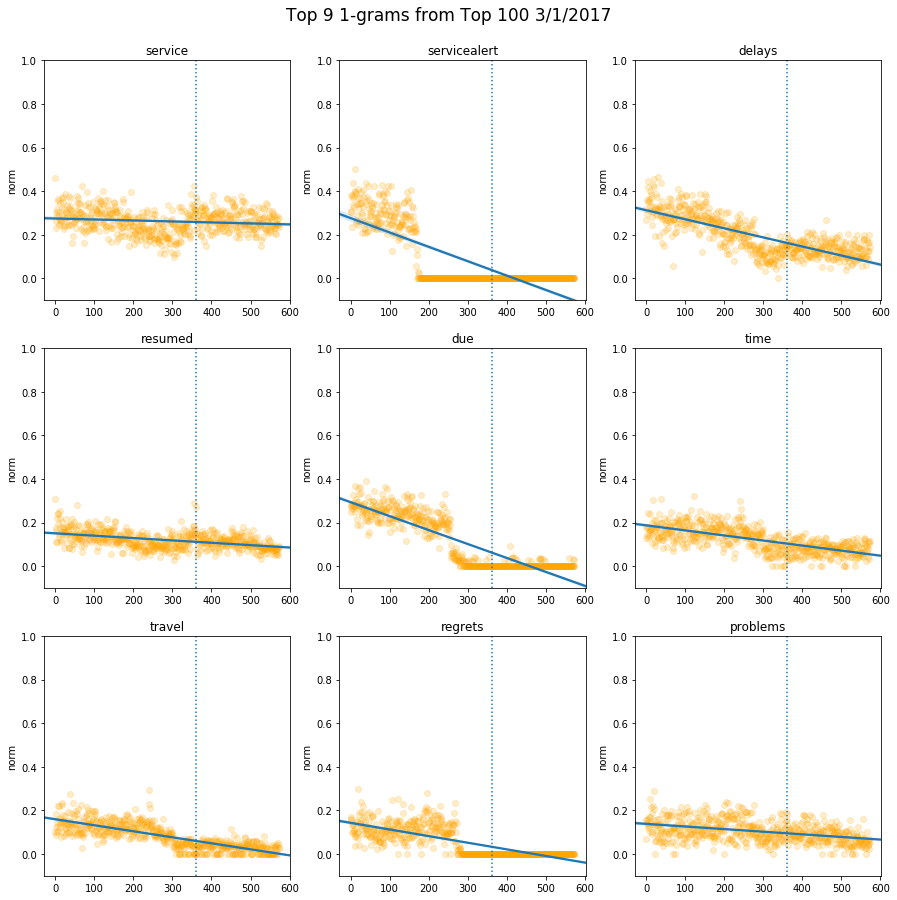
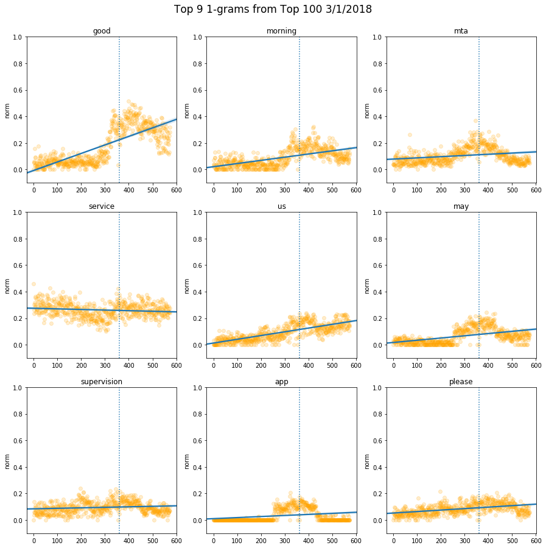
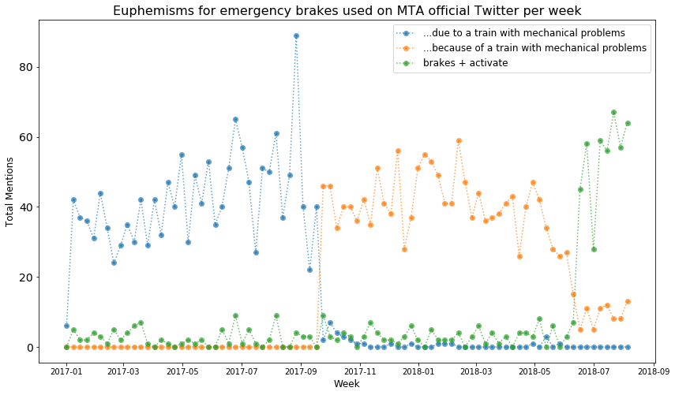

This year, the New York Metropolitan Transit Authority made a splash by very publicly hiring a new team of public-facing employees. Subway service has notably declined in our fair city, to put it lightly, as officials opted to spend on high-profile new lines and station remodeling and random bailouts to forlorn ski resorts, instead of performing desperately-needed maintanance. Making matters worse was the very public feud between New York Governor Andrew Cuomo and New York City Mayor Bill DiBlasio: Ownership of the quasi-public MTA is a complicated issue, as its jurisdiction extends beyond the city limits (to say nothing of the financial implications of its performance for the entire state), and it can be tough to suss out where one man's responsibility ends and the other's begins. To say the least.

Anyways, while it remains unclear when the hell the subway will once again run reliably, these new hires meant a significantly improved social media team. The official MTA twitter feed (@NYCTSubway, for some reason) no longer only tweets cryptic, formulaic messages with vague warnings. Service advisories are more timely and somewhat less opaque. The account now also responds to individual tweets complaining about service.

A few months back, I contacted Aaron W. Gordon, of the excellent [Signal Problems](https://signalproblems.substack.com/welcome) newsletter ("a newsletter about what the hell is going on with the subway") to see if he had any data that needed wrangling. While he didn't have anything concrete, he suggested I take a look at the MTA twitter archives and see what I could see.

## Gathering the data
I used [GetOldTweets](https://github.com/Jefferson-Henrique/GetOldTweets-python), to download tweets as needed. The archives go back several years, but this post focuses on tweets between January 2017 and September 2018.

## Detecting patterns
Given the context of the MTA's changing approach to social media, I decided to look for changes in syntax before and after January 1, 2018, which is more or less when the MTA changed its approach to Twitter. So I tracked the appearance of every word in the tweet vocabulary over time.

This is a plot of the 9 words the MTA tweeted the most over the entire date range. Every orange dot represents a day, and the vertical line is January 1, 2018.

While usage remains constant for some words, others change dramatically. Use of "hi" and "good" goes up, presumably as personalized tweets become more common, and "due" drops off. "Delays" and "time" both decrease as well, although less dramatically.

Here's the same plot, but for the words most common in March 2017 (although over the same date range).

And here's March 2018.

## Applying the research
A little while later, Aaron had a hunch that service alerts about emergency brakes had increased. On June 28th, [the MTA noted](https://twitter.com/NYCTSubway/status/1012343209295536128) that they had a new policy to explicity mention when a train's emergency brakes were set off, as opposed to calling such incidents "mechanical problems". So he hit me up to look into it.

Sure enough, there was a dramatic shift in the way the MTA described these problems. At the start of 2017, it's "due to a train with mechanical problems". In October 2018, it changes to "because of ..." for some reason. And then, in June of 2018, use of "mechanical problems" drops off, replaced almost entirely with specific mentions of "brakes" and some form of "activation".

